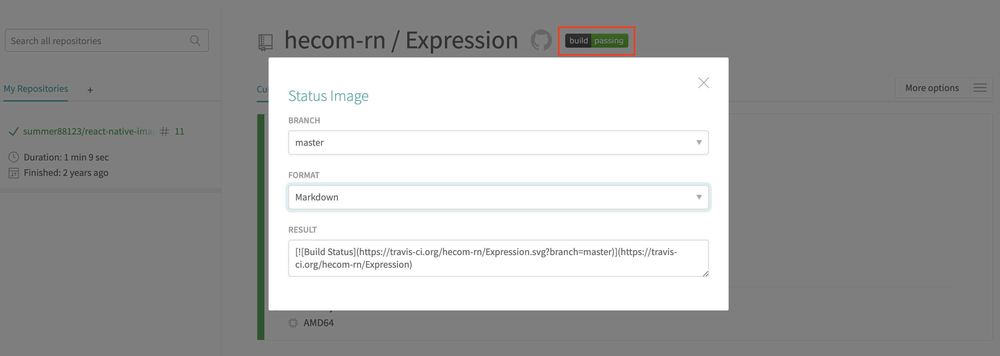

Travis CI自动发布新版本功能配置模板。

#### .travis.yml介绍：
在通过git hook触发后，Travis CI通过.travis.yml文件声明的内容来执行自动化工作。自动发布工作主要通过stage:deploy来完成。
```yaml
language: node_js
node_js:
 - "10"
os:
 - linux

stages:
 - test
 - name: deploy
   if: tag =~ ^v  // 只有v开头的tag才会触发deploy，例如：v1.0.0

jobs:
  include:
    - stage: test  
      script:
        - npm lint // 可以在script中定义stage需要执行的具体命令
        - npm test
    - stage: deploy
      deploy:
        provider: npm // 发布到npm
        api_key: "$NPM_TOKEN"  // 对应travis-ci网站上设置的环境变量
        on:
          tags: true // 只有提交tag时才触发

```
#### package.json介绍
```json
{
  "name": "@hecom/template",
  "version": "0.0.1",
  "scripts": {
    "patch": "npm version patch -m 'Bump version %s';git push origin master --tags",
    "minor": "npm version minor -m 'Bump version %s';git push origin master --tags",
    "major": "npm version major -m 'Bump version %s';git push origin master --tags"
  }
}
```
- name: 发布到npm的项目名称
- version: 发布版本，x.y.z格式
- scripts: 特殊命令
    - patch: 自动更新修订号，添加tag，并推送master分支和tag到远端，触发travis
    - minor: 自动更新次版本号，添加tag，并推送master分支和tag到远端，触发travis
    - major: 自动更新主版本号，添加tag，并推送master分支和tag到远端，触发travis

发布新版本时，使用`yarn patch`、`yarn minor`、`yarn major`命令发布对应的版本即可

建议版本号的使用遵循 [语义化版本](https://semver.org/lang/zh-CN/) 规范

#### travis-ci.com介绍
对于一个全新的GitHub项目，可以通过以下步骤开启travis

1.打开[travis-ci.com](https://travis-ci.com)官网，并使用GitHub账号登录。

2.接受Travis CI的授权。 您将被重定向到GitHub。

3.单击Travis仪表板右上方的个人资料图片，单击“设置”，然后单击绿色的“激活”按钮，然后选择要用于Travis CI的存储库。
> 或者您单击入门页面上的使用GitHub Apps激活所有存储库按钮以仅激活您的所有存储库

4.将.travis.yml文件添加到git中，提交并推送以触发Travis CI构建：
> 在添加.travis.yml文件后，Travis仅在push的提交上运行构建。

5.通过访问Travis CI并选择您的存储库，检查构建状态页面，以根据构建命令的返回状态查看您的构建是否通过或失败。

P.S. [travis-ci.com文档](https://docs.travis-ci.com/user/tutorial/#to-get-started-with-travis-ci-using-github)

#### 关于构建结果状态的徽标
在Travis CI的存储库详情页，点击徽标，打开如下图的对话框

选择要展示的分支，和格式化的方式，例如要在Markdown文档中展示，就将FORMAT选择为`Markdown`。
复制RESULT中展示的内容，并粘贴在需要使用的文档中即可
